<div align="center">
  <h1>CoverFi</h1>
  <p><strong>Decentralized Event Cancellation Micro-Insurance</strong></p>
  <p>
    Powered by <strong>Chainlink CRE</strong>, <strong>x402 Micropayments</strong>, <strong>USDC</strong>, and <strong>Gemini AI</strong>.<br/>
    Built for the Chainlink Converge Hackathon.
  </p>
</div>

<br />

## 🎥 Demo Video

[](https://www.youtube.com/watch?v=YOUR_VIDEO_ID)
> *Watch our 3-minute demo showcasing the Chainlink CRE workflow simulated via CLI and integrated into the CoverFi web application.*

---

## 🚀 Overview

**CoverFi** provides transparent, programmatic micro-insurance for real-world and online events. 
Users submit an event link (e.g., Luma, Eventbrite), receive an instant premium quote, purchase a non-transferable **Soulbound Policy NFT**, and receive automated USDC payouts if the event is canceled. 

No hidden databases. No opaque underwriting. All critical state and logic are enforced directly onchain.

### ⚡ The Problem
Event organizers, sponsors, and attendees frequently face financial loss when events are abruptly canceled. Traditional insurance is slow to process claims, burdened with manual verification, opaque in its pricing, and has high minimum premiums that lock out smaller, niche events.

### 💡 The Solution
We've built a single-workflow protocol that solves this:
- **Instant Quotes:** Request coverage with just an event link.
- **Pay-Per-Action (x402):** API endpoints are gated and metered via x402. Quotes and claims consume micro-fees.
- **AI-Powered Risk Assessment:** Gemini analyzes qualitative venue data and event complexity to feed a dynamic pricing model.
- **Deterministic Settlement:** Chainlink Cross-Chain Relay (CRE) verifies event status. If canceled, the Chainlink DON automatically settles the claim directly to the Policy NFT holder.

---

## 🏗 Architecture

CoverFi is built around a single Chainlink CRE workflow that acts as the orchestrator, communicating with smart contracts strictly through a Forwarder.

```mermaid
flowchart LR
    %% Styles matching the reference dark aesthetic
    classDef client fill:#1E1E1E,stroke:#444,stroke-width:2px,color:#fff;
    classDef creWorkflow fill:#1e3a8a,stroke:#60a5fa,stroke-width:2px,color:#fff;
    classDef aiAgent fill:#0A0A0A,stroke:#1e3a8a,stroke-width:2px,color:#fff;
    classDef report fill:#14532d,stroke:#4ade80,stroke-width:2px,color:#fff;
    classDef receiver fill:#4c1d95,stroke:#c084fc,stroke-width:2px,color:#fff;
    classDef registry fill:#1a1a1a,stroke:#E0E0E0,stroke-width:1px,color:#fff;
    classDef vault fill:#1a1a1a,stroke:#E0E0E0,stroke-width:1px,color:#fff;
    
    subgraph ClientLayer ["Client Interface"]
        direction TB
        User["🦊 User + Wallet"]:::client
        dApp["💻 CoverFi dApp\n(Next.js x402)"]:::client
        User -->|"Signs tx /\nPays x402 Fee"| dApp
    end

    subgraph CRELayer ["Gemini AI & Off-Chain Automation"]
        direction TB
        subgraph Agents ["Information & Intelligence"]
            direction LR
            Gemini["🧠 Gemini AI \n(Venue/Complexity)"]:::aiAgent
            Luma["🌐 Event API \n(Status Validation)"]:::aiAgent
        end
        Workflow["Chainlink CRE\nCoverFi Workflow\n(Off-chain Orchestration)\ntrigger: /quote, /mint, /claim"]:::creWorkflow
        Gemini <-->|"Provide Context"| Workflow
        Luma <--> Workflow
    end

    dApp -->|"Requests via x402"| Workflow

    Report["📜 CRE Report\n(DON Signed)"]:::report
    Workflow -->|"Generates Payload"| Report

    subgraph OnchainLayer ["Base Sepolia (On-Chain Execution)"]
        direction TB
        CREReceiver["⚙️ CREReceiver Contract\nConsumes CRE Report"]:::receiver
        PolicyNFT["🎟️ PolicyNFT (ERC721)\nStores Active, Paid,\nResolved statuses\n(Soulbound)"]:::registry
        PolicyVault["🏦 PolicyVault\nHolds USDC Reserves\nChecks Solvency (Reserve Ratio)"]:::vault
        
        CREReceiver -->|"If mint: mintPolicy()\nIf claim: state transition"| PolicyNFT
        CREReceiver -->|"If claim: routes settlement\nLocks USDC deposit"| PolicyVault
        PolicyNFT -.->|"Reads liability"| PolicyVault
    end

    Report -->|"tx: onReport()\nForwarder-gated"| CREReceiver
    User -.->|"Reads Coverage Status"| PolicyNFT
    PolicyVault -->|"Transfers Claim USDC"| User
```



### Onchain Contracts (Base Sepolia)
- **PolicyNFT (ERC721):** Soulbound policy records. Transfer and approval paths are disabled. Mints and state transitions (ACTIVE → PAID / RESOLVED) are gatekept.
- **PolicyVault:** The financial engine. Holds USDC reserves. Solvency is mathematically enforced before any new liability is assumed (`balance >= (liability * reserveRatio)`). 
- **CREReceiver:** The entrypoint for the Chainlink CRE DON. It decodes secure offchain reports and routes minimal state transitions into the Vault and NFT.

### Offchain CRE Workflow
A single Chainlink CRE workflow handles three core actions:
1. `QUOTE_CHECK`: Validates the event, calculates the dynamic premium via Gemini + localized risk bands, and signs a deterministic quote.
2. `MINT`: Verifies the signed quote, enforces the reserve checks, and triggers the onchain policy mint.
3. `CLAIM`: Checks the canonical event status on resolution. Triggers `PAY` if canceled, or `RESOLVE_NO_PAYOUT` if the coverage window expires without cancellation.

<br/>

## 🔑 Security & Invariants
CoverFi is designed with a strict "Don't Trust, Verify" model:
- **No Backend Database:** State is derived entirely from the onchain PolicyVault and PolicyNFT.
- **Tamper-Resistant Signatures:** Quotes are cryptographically signed by the CRE DON, protecting against quote manipulation.
- **Forwarder-Gated Execution:** `CREReceiver` strictly requires `msg.sender == KeystoneForwarder` or `msg.sender == CREReceiver`.
- **Monotonic State Transitions:** Policies move strictly from `ACTIVE` to either `PAID` or `RESOLVED_NO_PAYOUT`.
- **Mathematical Solvency:** Policies cannot be minted if the Vault falls below the defined Reserve Ratio (e.g., 110%).

---

## 🌐 Tech Stack & Integrations

- **Oracle & Workflow:** [Chainlink CRE](https://docs.chain.link/cre) (Cross-Chain Relay Environment)
- **Smart Contracts:** Solidity (Hardhat)
- **Network:** Base Sepolia *(Sponsor Prize Candidate)*
- **Micropayments:** x402 Protocol
- **Risk AI:** Google Gemini API (`gemini-2.0-flash`) *(Sponsor Prize Candidate)*
- **Frontend:** Next.js, React, HeroUI, Tailwind CSS
- **APIs:** Eventbrite API (Extensible to Luma, etc.)

### ⛓️ Chainlink CRE Files
This project specifically fulfills the requirement to build and simulate a CRE Workflow. The workflow integrates a blockchain (Base Sepolia) with an external API (Eventbrite) and an LLM (Gemini). The core Chainlink files are:
- [`workflows/event-microinsurance/main.ts`](./workflows/event-microinsurance/main.ts): The primary entry point for the Chainlink CRE workflow.
- [`workflows/event-microinsurance/actions/quote.ts`](./workflows/event-microinsurance/actions/quote.ts) & related actions: Invoked by CRE to fetch external API data, assess risk with Gemini, and interact onchain.
- [`contracts/src/CREReceiver.sol`](./contracts/src/CREReceiver.sol): The smart contract designed to receive secure `onReport` transactions from the Chainlink Forwarder.

---

## 📂 Repository Structure

```text
├── client/                 # Next.js web application
├── contracts/              # Hardhat project (PolicyNFT, Vault, Receiver)
├── workflows/              # Chainlink CRE workflow definitions & TS logic
│   └── event-microinsurance/ # Core CRE workflow implementation
└── docs/                   # Architecture and model documentation
```

---

## 🚀 Quick Start (Local & Testnet)

*(Detailed setup instructions for developers looking to run CoverFi locally or deploy their own instance.)*

### Prerequisites
- Node.js >= 18
- Hardhat
- A Base Sepolia RPC & testnet USDC

### 1. Smart Contracts
```bash
cd contracts
npm install
# Deploy the protocol (NFT, Vault, Receiver)
npx hardhat run scripts/deploy.cjs --network baseSepolia
# Fund the vault with USDC (Required for solvency)
npx hardhat run scripts/fund_vault.cjs --network baseSepolia
```

### 2. CRE Workflow Simulation
As per hackathon requirements, this workflow can be successfully simulated via the CRE CLI. It integrates onchain logic with Gemini AI and external event APIs.

```bash
cd workflows
npm install
# Test the workflow locally via Chainlink CRE CLI
npx cre-cli run event-microinsurance --payload test-payloads/quote-check.json
```

### 3. Frontend
```bash
cd client
npm install
npm run dev
```

---

## 🤝 Contributing
We welcome contributions! As a hackathon project, we embrace rapid iteration and community feedback. Feel free to open issues, submit PRs, and suggest architectural improvements.

---

## 🛡 Disclaimer
CoverFi is a hackathon prototype built for educational and demonstrative purposes within the Chainlink Converge hackathon. It is not audited and should not be used in production with real funds. 

---

<div align="center">
  Built with 💙 for <b>Chainlink Converge</b>
</div>
