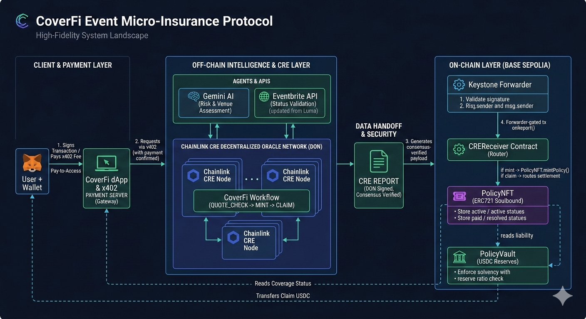

<div align="center">
  <h1>CoverFi</h1>
  <p><strong>Onchain event insurance for organizers who want transparent protection against cancellation risk.</strong></p>
  <p>Don't just gamble, insure. Protect against event risk without betting on outcomes.</p>
  <p>Open micro-insurance protocol on Base Sepolia.</p>
  <p>
    
    
    
    
  </p>
</div>

CoverFi lets event organizers check eligibility, pay for coverage, and settle claims through a wallet-native flow backed by Chainlink CRE, `x402`, USDC reserves, AI-driven risk signals, and protocol-enforced solvency rules.

<table>
  <tr>
    <td width="50%" valign="top">
      <strong>x402 Payments</strong><br />
      Metered quote, buy, and claim endpoints designed for machine-readable access and onchain premium collection.
    </td>
    <td width="50%" valign="top">
      <strong>AI-Driven Signals</strong><br />
      Pricing combines external event data with AI-assisted risk signals to produce fast, transparent quote terms.
    </td>
  </tr>
  <tr>
    <td width="50%" valign="top">
      <strong>Protocol Solvency</strong><br />
      Reserve-ratio checks run before new liability is accepted, keeping coverage backed by vault reserves.
    </td>
    <td width="50%" valign="top">
      <strong>Wallet-Native Policies</strong><br />
      Soulbound policy NFTs and deterministic settlement keep ownership, status, and claim outcomes visible onchain.
    </td>
  </tr>
</table>



## Why CoverFi

Event organizers often commit venue deposits, marketing spend, and talent fees before revenue is fully locked in. CoverFi turns that cancellation risk into an onchain insurance flow with transparent pricing, wallet-owned policy state, and deterministic claim settlement.

This repository contains the web app, smart contracts, and workflow logic that power the protocol.

## Features

- `x402` pay-to-access APIs for quote, buy, and claim actions
- Chainlink CRE workflow orchestration for quote, mint, and claim execution
- AI-driven signals layered into pricing and underwriting
- Protocol-level solvency compliance enforced by the vault before new liability is accepted
- USDC reserve accounting for active coverage and claim payouts
- Soulbound policy NFTs that keep policy ownership tied to the insured wallet
- Deterministic settlement with explicit `PAY`, `RESOLVE_NO_PAYOUT`, or `NO_OP` outcomes
- No hidden policy database; critical state lives onchain

## How It Works

### 1. Quote

The user submits an event URL and coverage tier. CoverFi validates the event, checks reserve capacity, runs pricing logic, and returns a signed quote with premium and payout terms.

### 2. Buy

The approved quote is paid through `x402`, then minted into an onchain policy. The protocol activates coverage only if reserve requirements still hold.

### 3. Claim

When the event outcome is known, CoverFi checks the canonical event status and settles the policy onchain. If cancellation criteria are met, the vault pays the claim to the policy owner.

## Architecture

### Onchain

- `PolicyVault`: Holds USDC reserves and enforces the minimum reserve ratio
- `PolicyNFT`: Soulbound ERC-721 policy record with monotonic status transitions
- `CREReceiver`: Gated execution entrypoint that routes verified reports into the protocol

### Offchain

- Next.js app for the user flow and API surface
- Chainlink CRE workflow logic for quote, mint, and claim execution
- External event verification
- Gemini-powered AI signals used in pricing
- `x402` payment rails for metered access and premium collection

## Security Model

- Forwarder-gated state transitions
- Signed quotes with expiry protection
- Strict policy lifecycle controls: `ACTIVE -> PAID` or `ACTIVE -> RESOLVED_NO_PAYOUT`
- Solvency checks before policy activation
- Claims paid to the current policy holder
- No upgradeable proxy layer in the protocol contracts

## Base Sepolia Deployment

Current deployment recorded on March 9, 2026 in [`contracts/baseSepolia.json`](./contracts/baseSepolia.json):

- Network: Base Sepolia (`84532`)
- USDC: `0x036CbD53842c5426634e7929541eC2318f3dCF7e`
- PolicyVault: `0x959d812153a2c80178478e518f4E3033a467B62D`
- PolicyNFT: `0xDe2E4b017A0c453Ef527519701DaD32ed164c5E7`
- CREReceiver: `0xF0e47056A1ab670F11Ae066F1661952f5ae35d1d`
- Forwarder: `0x82300bd7c3958625581cc2f77bc6464dcecdf3e5`
- Minimum reserve ratio: `11000` bps (`110%`)

## Repository Layout

```text
client/                       Next.js frontend and API routes
contracts/                    Solidity contracts and deployment scripts
workflows/event-microinsurance/ Chainlink CRE workflow implementation
docs/                         Product and protocol reference material
```

## Quick Start

### Run the app locally

```bash
cd client
npm install
npm run dev
```

Open `http://localhost:3000` for the landing page and `http://localhost:3000/app` for the protocol flow.

### Useful local commands

```bash
cd client
npm test
npm run lint
```

```bash
cd workflows/event-microinsurance
npm install
npm test
```

## Who It Is For

CoverFi is designed for:

- independent promoters
- creator-led events
- private event planners
- community festival operators
- teams that want transparent, programmable cancellation cover

## Project Status

CoverFi is an open-source prototype built around a real end-to-end flow: quote, policy mint, and claim settlement. It is suitable for demos, experimentation, and further development, but it has not been audited for production use.

## Contributing

Contributions are welcome. See [CONTRIBUTING.md](./CONTRIBUTING.md) and [CODE_OF_CONDUCT.md](./CODE_OF_CONDUCT.md).

## License

Released under the [MIT License](./LICENSE).

## Disclaimer

This project is experimental software. Do not use it with meaningful funds or in production environments without a full security review, legal review, and operational hardening.
